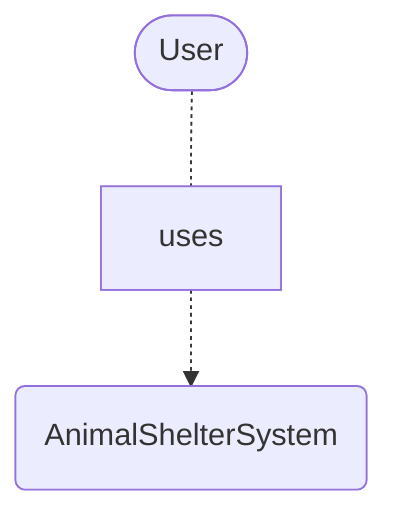
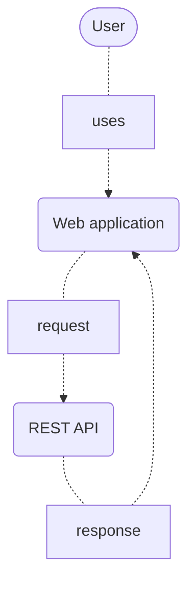
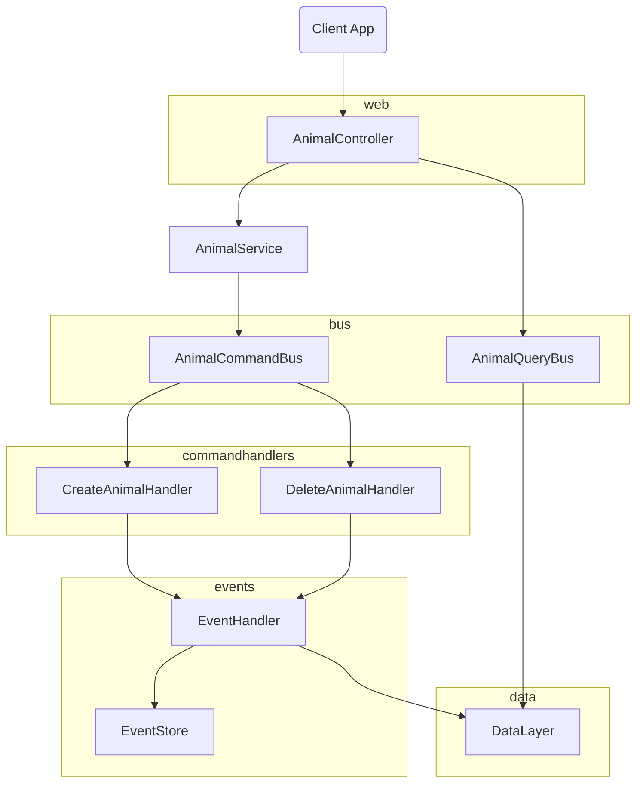
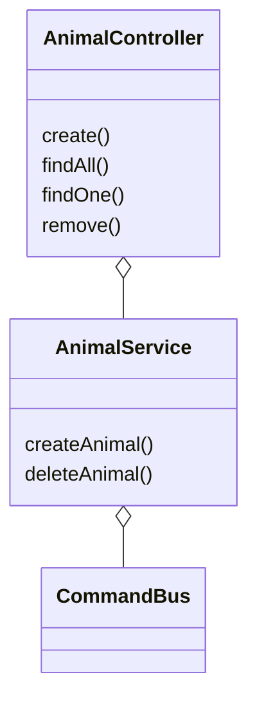

# Animal Shelter
AnimalShelter is an example project that manages adoption of pets from a shelter

## Description

This project is an example for the implementation of CQRS and Event Sourcing in a basic REST API type application using Nest JS and EventStoreDb.

The Client is a simple Angular application used to interact with the back-end

## Installation

For the back-end, from the root of the repository:
```bash
cd AnimalShelter-API
docker compose up
```
For the front-end client
```bash
cd AnimalShelter-Client/AnimalShelter
npm install
npm run start
```

## Structure

### System Context Diagram


### Container Diagram


### Component Diagram


### Code
